# Создай свой первый вебсайт за 2 часа

## Устанавливаем программы
1. Скачай и установи [Google Chrome](https://www.google.com/chrome/) если у тебя его ещё нет
1. Скачай и установи [VSCode](https://code.visualstudio.com/)
    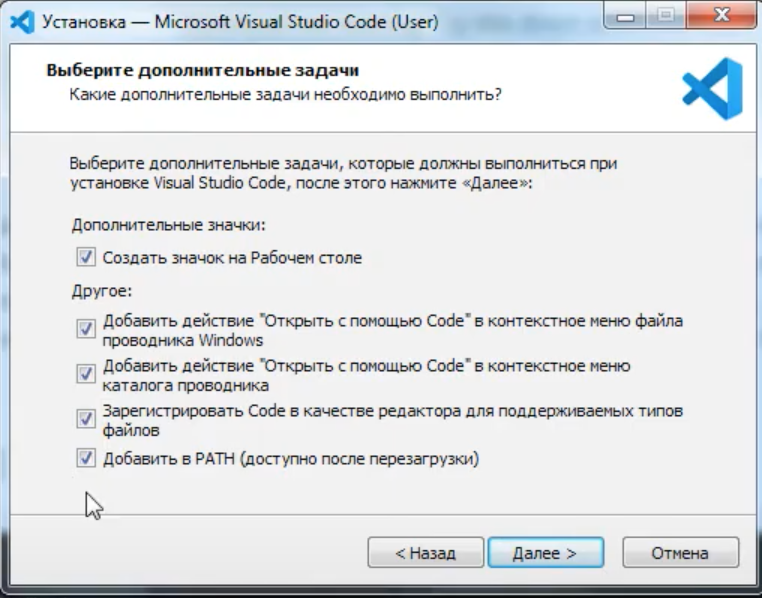

1. Скачай и установи [GIT](https://git-scm.com/)
    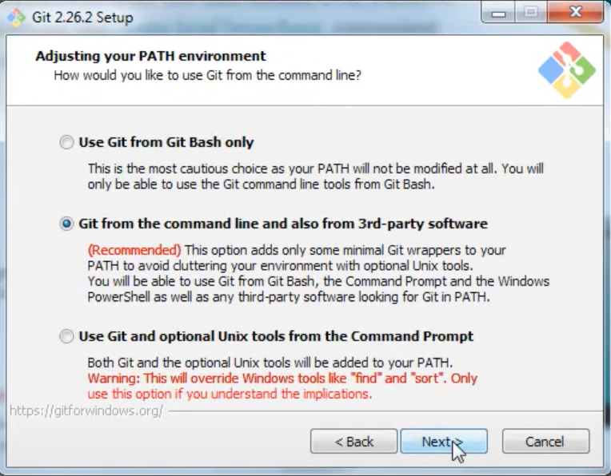
    
    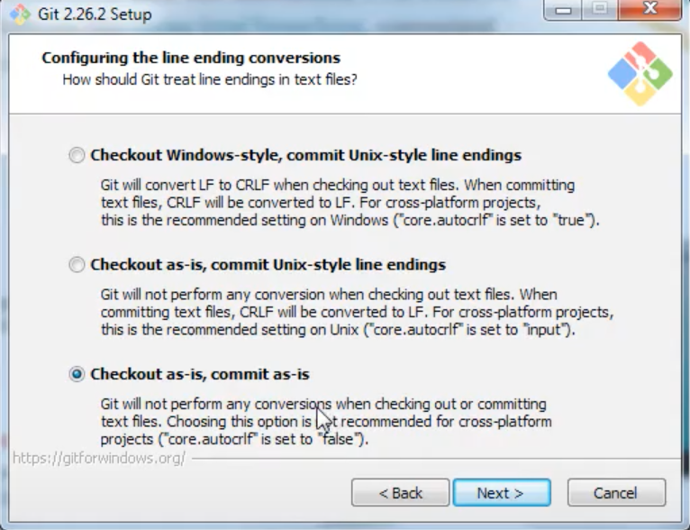
    
## Настраиваем GIT
1. Создай пустую директорию `my-first-page` и открой её в проводнике
1. Нажми правой клавишей и выбери `Git Bash Here`
1. Набери в терминале `git config --global user.name "Your Name"`
    - Напиши своё имя, а не `Your Name` :-)
    - Не забудь нажать `Enter`
1. Запусти в терминале `git config --global user.email "Your@Email"`
    - тут твоя почта, а не `Your@Email`

## Создаём сайт 
1. В терминале запусти команду `code .` - после неё откроется VSCode
1. Создай новый файл с названием `index.html`
    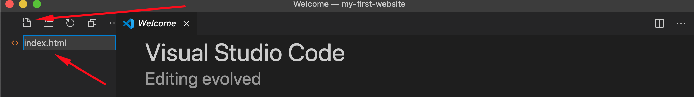

1. В первой строке файла `index.html` набери `!` и нажми табуляцию. У тебя появится такой текст:
    ```html
    <!DOCTYPE html>
    <html lang="en">
    <head>
      <meta charset="UTF-8">
      <meta name="viewport" content="width=device-width, initial-scale=1.0">
      <title>Document</title>
    </head>
    <body>
      
    </body>
    </html>
    ```
1. Набери в пустой строке между `<body>` и `</body>` текст `Привет! Я - Твоё Имя`
1. Сохрани нажав `ctrl + S` (`cmd + S` если у тебя MacOS)
1. Открой в проводнике директорию `my-first-page` и нажми правой кнопкой на файле `index.html`
1. В меню выбери пункт `Открыть с помощью` и выбери программу `Google Chrome`.
1. У тебя должна открыться твоя страница со словами `Привет! Я - Твоё Имя`

**Поздравляю! - Вы создали первую WEB-страницу.**

## Создаём аккаунт на Github
1. Зарегистрируйся на [Github](https://github.com/join) если у вас ещё нет аккаунта
    - Введите `Username`, `Email address` и `Password`
    - Нажмите кнопку `Проверить` (`Check`) и решите задачки 
    - Нажмите `Create account`
1. Заполните анкету 
    - What kind of work do you do, mainly? (например `Software Engineer`)
    - How much programming experience do you have? (например `A little`)
    - What do you plan to use GitHub for? (Например `Learn to code` и `Host a project`)
    - Нажмите `Complete setup`
1. Откройте ваш почтовый ящик указанный при регистрации 
    - в письме `[GitHub] Please verify your email address.` нажмите ссылку `Verify email address`

## Пора показать ваш сайт миру!
1. Создайте новый репозиторий на Github
    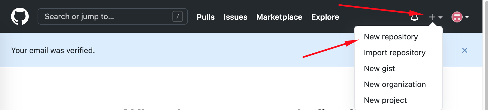

1. Введите основные данные репозитория
    - введите название
    - Проверьте что выбран `Public`
    - Поставьте галочку `Add a README file`
    - Нажмите кнопку `Create repository`
    
    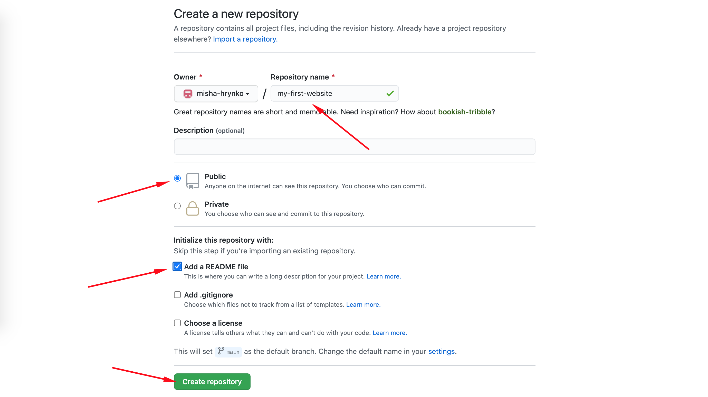

1. Найдите ссылку для скачивания  
    - Нажмите зелёную кнопку `Code`
    - Проверьте что выбран `HTTPS`
    - Скопируйте ссылку

1. Откройте терминал в папке `my-first-page` (Правой клавишей внутри и `Git Bash Here`)
1. В терминале выполните команду `git clone сюда-вставьте-скопированную-ссылку`.
1. Внутри папки `my-first-page` появится папка `my-first-website`
1. Перенесите файл `index.html` в папку `my-first-website`. 
    - Это можно сделать вручную через проводник или в терминале командой
        ```
        mv index.html my-first-website/index.html
        ```
1. Откройте терминал во внутренней папке `my-first-website`
1. Запустите поочереди следующие команды
    ```
    git add index.html
    git commit -m 'My first page'
    git push
    ```
    - Последняя команда попросит вас ввести `username` (то что вы ввели при регистрации на Github) и нажать `Enter`
    - Дальше вводим пароль (символы отображаться не будут) и снова `Enter`
    - Если ошиблись, запускаем `git push` ещё раз и вводим опять имя и пароль
1. Если всё ок, то открывайте ваш репозиторий на `Github`
    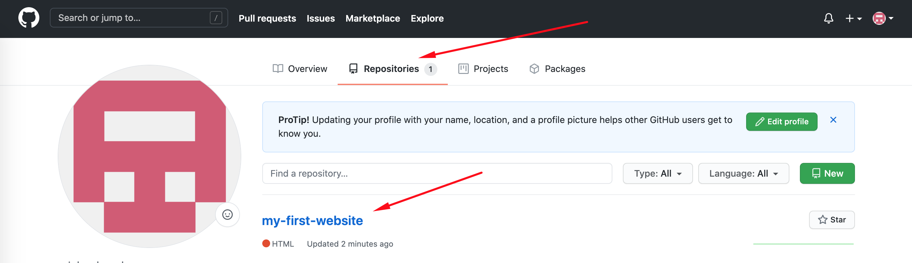
1. Там должно быть 2 файла `README.md` и `index.html`
    - Если `index.html` - значит `git push` не сработал (запускайте ещё раз и читайте ошибку)
1. Переходим в закладку `Settings`
    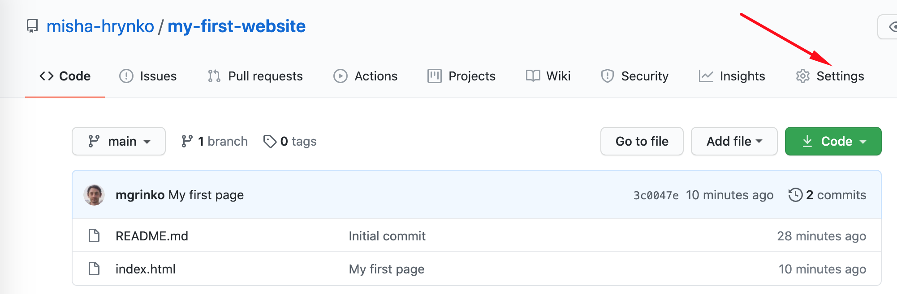
1. Пролистываем до раздела `GitHub Pages`
1. Выбираем в выпадающем списке `main`
    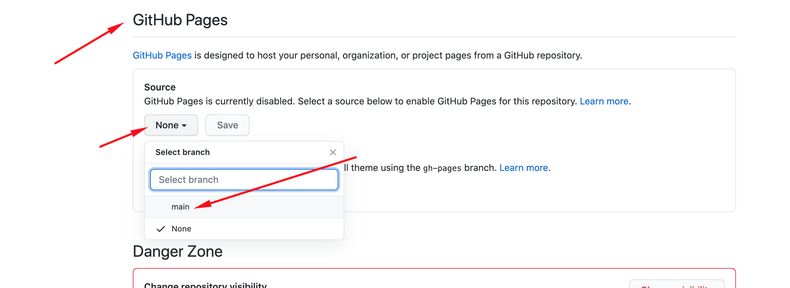
1. И нажимаем `Save`
    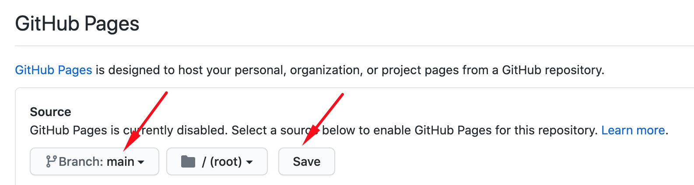
1. Ждём пока ссылка на GH-Pages станет зелёной (примерно минуту)
    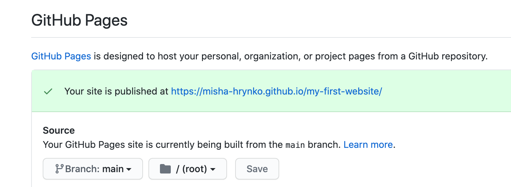
1. Открываем её и видим вашу страницу
1. Теперь можно поделиться вашей ссылкой!
